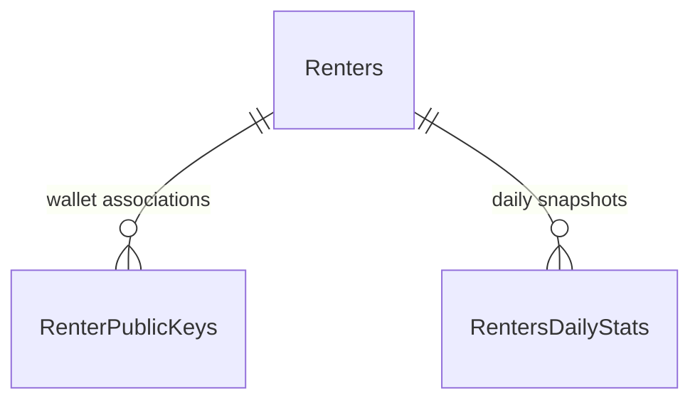

# Renter information implementation plan

This plan is based on live table definitions and the current PHP website. No application table rows were read or used. The requested `tabRentersDailyStats` is named **`RentersDailyStats`** in the configured primary database; `tabRentersDailyStats` was not found among accessible tables. All three relevant tables are available through the existing primary database connection.

## Design requirements

- `renter_wallet_address` is the canonical, unique renter identifier. All renter details, history, URLs, and cache identities use this address. A renter public key is a lookup value that must be translated to the correct wallet before displaying renter information.
- The database should hold ready-to-display metric values. The ingestion/aggregation layer owns metric calculations and persists their results. API endpoints primarily validate, select, filter, sort, paginate, cache, and serialize records; they must not reconstruct metrics from contracts or recalculate values already stored.
- Keep unavoidable request bookkeeping minimal. Display formatting (byte units, dates, currency presentation) is separate from metric computation. Do not move missing backend calculations into browser code as a workaround.

## 1. Schema findings

### `Renters`: current state per wallet

Primary key: `renter_wallet_address VARCHAR(78)`. One row represents a wallet address, not necessarily one person, organization, or renter installation.

| Fields | SQL types | Website use |
| --- | --- | --- |
| `first_seen_height`, `first_seen` | `INT`, `DATETIME` | First observed block and time |
| `last_active_height`, `last_active` | `INT`, `DATETIME` | Last observed activity |
| `active_contracts`, `active_hosts`, `active_public_keys` | `BIGINT UNSIGNED` | Current participation and host diversity |
| `contracted_filesize` | `BIGINT UNSIGNED` | Storage ranking and distribution |
| `refundable_allowance`, `host_revenue_committed` | `DECIMAL(50,0)` | Current contract funds |
| `active_renewed_contracts` | `BIGINT UNSIGNED` | Renewal participation |
| `average_contract_duration` | `DECIMAL(12,2)` | Average duration, once the unit and weighting are confirmed |
| `expiring_within_1_day`, `expiring_within_1_week`, `expiring_within_30_days` | `BIGINT UNSIGNED` | Upcoming contract expirations |
| `updated_height`, `updated_at` | `INT`, `DATETIME` | Source freshness |

All columns are non-null. Metric columns default to zero; identity, observation, and update columns require values. The only secondary index is `updated_height`; storage ranking and activity sorting currently have no dedicated indexes.

### `RenterPublicKeys`: observed wallet/key associations

| Fields | SQL types | Website use |
| --- | --- | --- |
| `renter_wallet_address`, `renter_public_key` | `VARCHAR(78)`, `VARCHAR(72)` | Wallet/key association |
| `first_seen_height`, `first_seen` | `INT`, `DATETIME` | First observation of the association |
| `last_seen_height`, `last_seen` | `INT`, `DATETIME` | Most recent observation |

All columns are non-null. The composite primary key is `(renter_wallet_address, renter_public_key)`, with a foreign key to `Renters` and a separate index on `renter_public_key`.

A wallet can have multiple keys, and a key can occur against multiple wallets: the key alone is not unique. This is a schema constraint observation, not a change to wallet-based identity. A key lookup must resolve the correct wallet before opening a profile; handle any ambiguous association explicitly as described below. This table has no active flag or contract count; an observed key must not automatically be labelled active. Its row count is not a substitute for `Renters.active_public_keys`.

### `RentersDailyStats`: daily state and activity per wallet

Primary key: `(renter_wallet_address, date)`, with a foreign key to `Renters`. `date` is `DATE`; `snapshot_height` is a required `INT`. A separate `date` index supports network-wide queries by day. The primary key supports one wallet's date range efficiently.

The table repeats all 11 current metric columns from `Renters`, with the same types and zero defaults, and adds:

| Fields | SQL types | Website use |
| --- | --- | --- |
| `contracts_formed`, `contract_revisions` | `BIGINT UNSIGNED` | Daily contract activity |
| `contracts_resolved_storage_proof`, `contracts_resolved_expiration`, `contracts_resolved_renewal` | `BIGINT UNSIGNED` | Daily resolution breakdown |
| `bytes_uploaded`, `bytes_removed` | `BIGINT UNSIGNED` | Daily contract data changes |
| `spending`, `funds_returned` | `DECIMAL(50,0)` | Daily fund movements |
| `renewal_funds_rolled`, `additional_renewal_funds` | nullable `DECIMAL(50,0)` | Renewal funding breakdown |
| `created_at`, `updated_at` | `TIMESTAMP` | Insertion and last row modification |

Except for the two renewal funding fields, columns are non-null. Timestamps default to the current timestamp; `updated_at` changes automatically on row updates. Preserve nullable renewal values as unknown, not zero.

All three tables use InnoDB and `utf8mb4_0900_ai_ci`. Identifier comparisons are therefore case-insensitive at the database level; validation must follow the producer's actual address/key encoding. No explicit cascading foreign-key actions are defined. There is no batch-completion marker or definition of metric units in this DDL.

## 2. Existing website integration points

- `renter_distribution.php`, `js/renter-distribution.js`, and `css/pages/renter-distribution.css` already provide a doughnut chart and largest-renters table.
- `/api/v1/storage/renter_distribution.php` computes storage totals from raw `Contracts`, grouped by wallet, but returns only sizes and totals. The UI consequently labels slices `Renter 1`, `Renter 2`, etc.
- `/api/v2/network/storage/renter-distribution.php` currently bridges that V1 endpoint through `NetworkService`; it does not query renter summaries.
- `include/header.html` already links Renter Distribution under Storage Network. `network_overview.php` can link to a broader renter overview.
- `contract_activity.php` already displays monthly unique renter identities. That metric must remain distinct from a current count of wallets with active contracts.
- The site has shared layout, Chart.js, range controls, locale/currency formatting, Redis caching, and a V2 `{data, meta, errors}` response envelope. Extend these conventions.

## 3. Confirm the producer data contract

The schema establishes shape and relationships, but not the producer's calculation rules. Review the ingestion/aggregation implementation and document:

1. The definition of an active contract and last activity, inclusion of V1/V2 contracts, renewal handling, and how contracts are assigned to wallets. Confirm whether `active_renewed_contracts` is a subset of `active_contracts`.
2. Whether `contracted_filesize` means the latest active contract filesize in bytes, and whether upload/removal figures describe on-chain filesize changes rather than measured network traffic. Avoid claiming unique user data or actual bandwidth from these fields alone.
3. Monetary units, the definitions of spending and committed revenue, and how returned/rolled/additional renewal funds overlap. Do not present committed revenue as realized revenue or refundable allowance as wallet balance. Convert to SC only after confirming the stored unit.
4. Duration units and averaging weights; whether expiration thresholds are cumulative and which block-time assumptions they use.
5. The daily timezone and cutoff, whether the current day is provisional, whether zero-activity days are written, and how late corrections/reorganizations update history.
6. Snapshot publication: whether `Renters` updates atomically and how a completed daily batch is identified. Neither `MAX(date)` nor `MAX(updated_at)` proves completeness. If necessary, add a producer-owned completion record with snapshot date/height and publish time; the website should consume completed batches.

Use these definitions for tooltips, API units, and fixtures. No population/backfill process is implemented by this website plan; coordinate that dependency with the data producer.

## 4. Website changes

### First release: distribution and renter explorer

Upgrade the existing distribution page to use `Renters.contracted_filesize`, after verifying equivalence with its current active-contract scope. Return each wallet alongside its size, show shortened addresses with copy controls, and link each row/slice to `/renter?address=...`. Preserve `/renter_distribution` as a stable route.

Have the producer publish distribution totals, wallet shares, and Others for the supported top-N sizes over the same population and snapshot. The endpoint reads those values without summing sizes or subtracting the remainder. Start with a fixed top 10; add other limits only when matching precomputed distributions are available. Define storage participants as wallets with positive contracted filesize, subject to the agreed active-contract rules. Show Others only when it has a meaningful remainder. Keep the stored count of active wallets separate, since a wallet may have active contracts with zero filesize.

Add `/renters` as a searchable, paginated renter directory. Default to wallets with `active_contracts > 0`, sorted by contracted filesize, with an option to include all observed wallets. Include address, storage, active contracts, active hosts, and last activity. Support exact wallet lookup and public-key-to-wallet resolution; always open details using the resolved wallet address. Use stable address tie-breaks for sorting.

Add `/renter?address=...` with:

- Current storage, contracts, host count, active key count, refundable allowance, and committed host revenue.
- First seen, last active, updated time/height, and links to existing address/block explorer routes.
- Average duration, active renewed contracts, and three clearly labelled expiration thresholds.
- A paginated observed-public-keys table with first/last seen times and heights. Keep observed and active key counts distinct.

Use wallet addresses as identifiers without inferring real-world identity or merging wallets sharing keys.

### Explorer public-key links

When an explorer displays a renter public key, resolve it through `RenterPublicKeys.renter_public_key` to `renter_wallet_address`, then link to `/renter?address=<resolved-wallet>`. All subsequent current-state and daily-history reads use that wallet. Multiple keys belonging to the same wallet must lead to the same profile.

If the explorer already has the contract's renter wallet address, use that explicit association to select/verify the mapping. Otherwise, an indexed exact key lookup can resolve a single matching wallet directly. The current schema does not enforce one wallet per key: if multiple matches exist, use an authoritative contract/transaction association to disambiguate. First/last seen bounds alone do not prove exclusive ownership at a given height. If context cannot establish a unique result, show the candidate wallet links explicitly rather than choosing the first or most recently seen row. An unmapped key shows a clear unavailable state. Do not create public-key-based renter profiles.

Add this resolution to the active explorer renter-key rendering paths and use a shared resolver so links behave consistently across contract and transaction views. Batch lookups when rendering lists to avoid one query/request per key.

### Second release: history and network overview

Add date-range charts to renter detail pages, defaulting to 30 days with 90-day, one-year, and custom bounded ranges:

- Storage and active contracts/hosts as snapshot series.
- Upload/removal bytes as separate activity series.
- Contract formations, revisions, and resolution categories.
- Spending and returned funds, with nullable renewal funding detail shown separately.

Add overview cards and charts to `/renters` backed by producer-published summaries: active wallet count, aggregate contracted storage, aggregate active contracts, daily spending, and storage concentration. Reuse these selectively on the network overview/dashboard, labelled with date and source. Keep the initial release focused; do not require a dashboard redesign.

Do not promise per-contract or per-host drill-down from these three tables: they contain no contract IDs or host identities. Such drill-down would require a separate raw-contract integration with revision/protocol deduplication and its own performance work.

## 5. Query and API design

Add `src/Services/V2/RentersService.php` using the existing primary `Database` connection and prepared statements. Keep indexed lookups and record selection in the service and rendering in page JavaScript. Read wallet metrics directly from `Renters` and `RentersDailyStats`; read network metrics from producer-maintained summaries. Do not perform request-time metric aggregation in PHP or hide it in SQL views executed per request.

Proposed endpoint files (extensionless equivalents follow the site's routing conventions):

| Endpoint | Purpose |
| --- | --- |
| `GET /api/v2/renters/index.php` | Paginated directory; wallet/key lookup, activity filter, allowed sorting |
| `GET /api/v2/renters/resolve.php?public_key=...` | Resolve a public key to the canonical wallet; accept validated explorer context for disambiguation and report unresolved/ambiguous results explicitly |
| `GET /api/v2/renters/details.php?address=...` | Current wallet state and observation metadata |
| `GET /api/v2/renters/public-keys.php?address=...` | Paginated wallet/key associations |
| `GET /api/v2/renters/daily.php?address=...&start=...&end=...` | Wallet history |
| `GET /api/v2/renters/overview.php` | Network renter summary from a coherent published snapshot |
| `GET /api/v2/renters/daily.php?start=...&end=...` | Precomputed network history when address is omitted |
| Existing V2 renter-distribution endpoint | Structured wallet slices, Others, totals, and snapshot metadata |

Keep existing V1 response fields/types stable. Change the V2 distribution source through a controlled switch, retaining its existing fields and adding wallet entries. Migrate this page's JavaScript explicitly from V1 to the V2 envelope. Do not silently mix fallback raw-contract results with summary-table totals; any fallback must expose its source and aggregation definition.

Validate identifier encodings after confirming them with the producer; enforce strict dates, ordered ranges, a maximum one-year daily window, and a maximum page size of 100. Allowlist sort fields/directions. Unknown wallet details return 404; a known wallet with no daily records returns an empty series. Database failures return the existing error envelope without SQL/credentials.

Expose units and actual source date/height alongside response-generation time. Use decimal strings for large integer and monetary values, including totals: unsigned BIGINT can exceed both PHP signed integer and JavaScript safe integer limits. Preserve stored precision through the endpoint; any presentation scaling must happen only after exact values have been retained. Existing currency helpers coerce to floats, so reuse their presentation conventions only after safe conversion; preserve exact raw values for API output and tooltips. Historical fiat conversion must use the corresponding date's rate or show unavailable rather than silently applying today's rate.

## 6. Producer-owned summaries and aggregation rules

The three existing tables cover wallet details, key mapping, and wallet daily charts directly. They do not store network totals, distribution shares/Others, or period summaries. Reuse suitable existing precomputed network data after confirming identical definitions; otherwise have the producer persist these additional datasets before enabling dependent widgets:

| Proposed dataset (physical names to be agreed) | Stored outputs |
| --- | --- |
| Current renter network summary | Snapshot identity/completion, active wallet and storage-participant counts, total storage/contracts, and other approved overview metrics |
| Daily renter network summary | Date/snapshot, daily network snapshot values and activity totals, and nullable-field coverage |
| Renter distribution snapshot | Snapshot, supported top-N size, wallet/rank/filesize/share entries, Others size/share/count, and population totals |
| Optional period summaries | Explicitly supported weekly/monthly/range totals and derived metrics only when the UI needs them |

Build these in the ingestion/aggregation job, publish them coherently, and refresh them after corrections. These are planned producer dependencies, not existing tables. Return daily records for arbitrary date-range charts without inventing a request-time range-summary calculation. If a requested derived value is not stored, defer that widget or extend the producer first. No additional summary is needed for a direct wallet field already available in the three tables.

The following rules govern producer calculations and their validation, not new arithmetic in API endpoints:

- Aggregate `Renters` directly for current totals. Never sum renter metrics after joining to keys; multiple key rows would multiply balances and counts. Use `EXISTS` for key filtering, or fetch keys separately.
- Aggregate daily rows by the same date and a completed snapshot. Do not combine each wallet's latest available date into a single network point without exposing the mixed coverage.
- Snapshot values (storage, current funds, active counts, duration, expiration counts) are not daily flows. For a later monthly view, use an explicitly defined end-of-period snapshot, not a sum across dates.
- Sum daily activity fields across a range only after confirming they are interval increments. Missing days remain gaps/unknown unless the producer guarantees that omission means zero.
- Summed `active_hosts` means renter-host relationships, not distinct network hosts. Summed `active_public_keys` may repeat keys associated with multiple wallets; these summaries cannot establish a globally unique active-key count.
- Count distinct wallet addresses across a period when presenting unique wallets; summing daily wallet counts is incorrect. Keep this definition separate from existing monthly contract-participation metrics.
- Do not average renter duration averages without knowing their weighting. A network duration average weighted by active contracts is valid only if each stored value uses exactly that denominator and scope.
- If expiration thresholds are cumulative, show overlapping thresholds, not stacked independent buckets. Disjoint buckets require validated subtraction.
- For nullable renewal amounts, report known sums plus coverage/partial-data information; SQL `SUM` ignoring unknown rows must not be presented as a complete total.
- Keep renewal funds rolled separate from new spending. Do not infer net spend or retention metrics until their definitions are supported.

## 7. Performance, empty states, and delivery

Use existing V2 cache-key helpers and `Cache::setCacheSeconds`. Start with a short cache for current data (for example 60 seconds), longer for completed historical days (for example one hour), and invalidate/version historical caches after corrections. Include filters, dates, pagination, and snapshot identity where available in keys. Short-cache empty responses so the first imported records become visible promptly. Align the browser cache with this policy; the current distribution JavaScript caches for 30 minutes.

Evaluate `(contracted_filesize, renter_wallet_address)` and `(last_active, renter_wallet_address)` indexes on `Renters` with realistic fixture volumes and query plans. Select additional indexes from the actual active-filter queries rather than adding every possible sort index. Existing wallet/date and key indexes cover basic detail and lookup paths. Use the producer-maintained daily network summary from the start for network history; measure its query/index performance without replacing it with request-time aggregation. Do not scan all raw contracts for each page load.

Render loading, no records, zero-valued records, partial/stale data, and request failures distinctly. Empty history should say “No renter history available yet”; it must not draw invented zero trends. A valid zero-storage dataset should avoid percentage division by zero and a meaningless doughnut. Preserve chart gaps and show source freshness. Build address/key DOM content with safe text insertion and encoded links; provide a usable table alongside charts, keyboard access, and existing responsive/dark-mode styles.

Implement in this order:

1. Confirm producer semantics, key-to-wallet resolution, and publication rules; identify existing reusable summaries and specify missing precomputed datasets. Document API fields/units and create synthetic fixtures in an isolated test database.
2. Coordinate producer delivery of missing summary values. Implement the renter service, shared public-key resolver, and V2 endpoints as read/serialization paths with precision preservation, caching, and targeted indexes.
3. Upgrade distribution and deliver the renter directory/detail pages with current state. Wire explorer renter-public-key links through the wallet resolver.
4. Add daily history and aggregate overview widgets with the agreed snapshot/flow rules.
5. Update `include/header.html`, `network_overview.php`, `api/v2/swagger.json`, `docs/v2_parity_map.md`, and the README; verify routes and roll out behind a configuration switch once producer readiness is established.

Acceptance checks should verify that API metric values match stored values without recalculation; distribution shares/Others come from the published snapshot; explorer key links open the correct wallet profile and its history; multiple keys resolve to the same wallet where appropriate; unmapped and ambiguous keys are handled explicitly; multiple keys do not multiply totals; deterministic rankings and correct Others totals; known-wallet empty history versus 404; missing dates versus explicit zeros; incomplete snapshots; null renewal amounts; zero denominators; very large monetary/byte values; cumulative expiration thresholds; invalid inputs; cache refresh after first import/corrections; and preservation of existing API fields. Validate representative query plans using synthetic volume, PHP syntax, and browser behavior on mobile/desktop and both themes. Do not use the currently empty production tables as evidence of metric behavior or query scalability.

Website implementation is now present. See [renter-data-contract.md](renter-data-contract.md) for implemented routes, read-only API behavior, and the optional producer publication contract. Producer jobs, production schema deployment, and confirmed unit/aggregation semantics remain external dependencies; unavailable network summaries are not calculated at request time.
